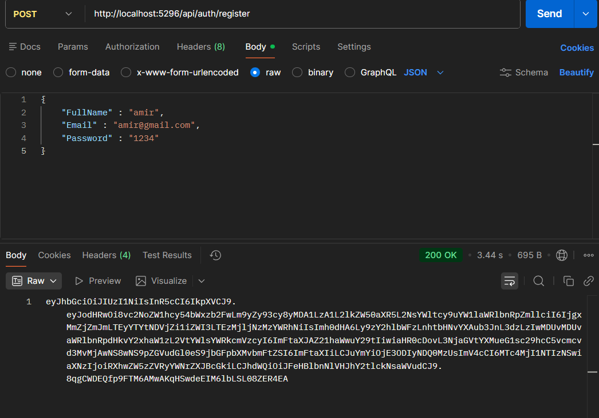
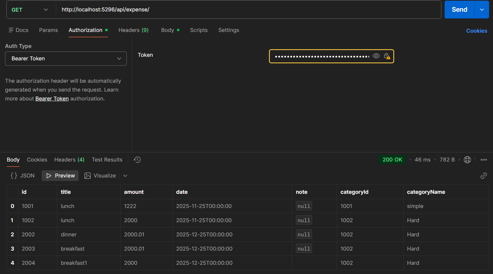
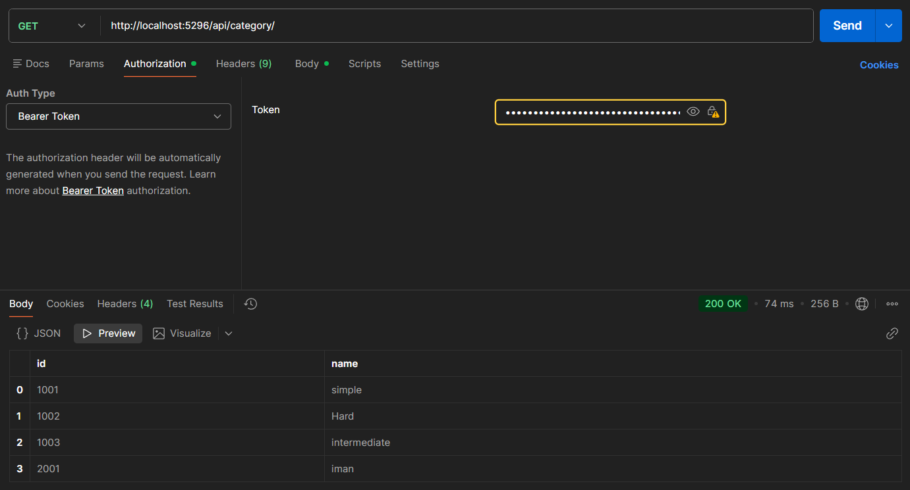
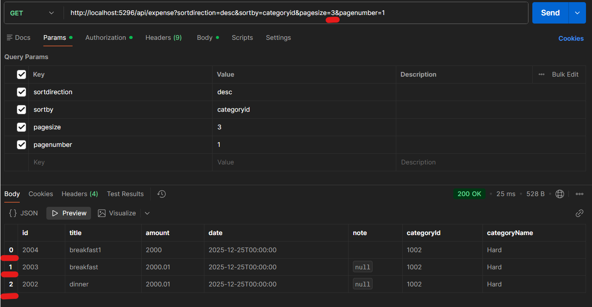

<h1 align="center">💰 Expense Tracker API</h1>

A clean and secure RESTful API built with <b>ASP.NET Core (.NET 9)</b> 
یک API تمیز و امن برای مدیریت هزینه‌ های شخصی

  
  
  
  
  

<h2>🚀 Features | امکانات</h2>

<ul>
  <li><b>Authentication (JWT)</b> – Register / Login / Secure Endpoints</li>
  <li><b>Expense Management</b> – Create, Get, Update, Patch, Delete</li>
  <li><b>Category Management</b> – Create, List, Delete</li>
  <li><b>Filtering, Sorting, Pagination</b></li>
  <li><b>FluentValidation</b> for request validation</li>
  <li><b>Centralized Exception Handling Middleware</b></li>
</ul>

ثبت‌نام، ورود، مدیریت هزینه‌ ها و دسته‌بندیها همراه با فیلتر، مرتب‌ سازی و صفحه‌ بندی.

<h2>🛠 Technologies | تکنولوژیها</h2>

<ul>
  <li>ASP.NET Core Web API (.NET 9)</li>
  <li>Entity Framework Core</li>
  <li>SQL Server</li>
  <li>AutoMapper</li>
  <li>FluentValidation</li>
  <li>JWT Authentication</li>
  <li>Repository Pattern</li>
  <li>Clean Architecture</li>
</ul>

<h2>📁 Project Structure | ساختار پروژه</h2>

<pre>
ExpenseTrackerAPI/
├── ExpenseTrackerAPI/           (API Layer - Controllers, Middleware)
├── ExpenseTracker.Application/  (DTOs, Interfaces, Validators, Filters,CustomException)
├── ExpenseTracker.DataLayer/    (Entities, EF Config, Repositories)
└── ExpenseTrackerAPI.slnx
</pre>

<h2>🔑 Main Endpoints | اندپوینت‌ های اصلی</h2>

<h4>Authentication</h4>

<pre>
POST   /api/auth/register
POST   /api/auth/login
</pre>

<h4>Expenses</h4>

<pre>
GET    /api/expenses
GET    /api/expenses/{id}
POST   /api/expenses
PATCH  /api/expenses/{id}
DELETE /api/expenses/{id}
</pre>

[نمایش تصویر عملیات patch](./ExpenseTrackerAPI/ImageExamples/PatchExample.png)

<h4>Categories</h4>

<pre>
GET    /api/categories
GET    /api/categories/{id}		
POST   /api/categories
PUT    /api/categories/{id}	
DELETE /api/categories/{id}
</pre>

<h2>🔑  Secondary Endpoints | اندپوینت‌ های فرعی</h2>

<pre>
صفحه بندی	
GET /api/expenses?pageNumber=1&pageSize=10 //پیش فرض بدون اعمال میشود

فیلتر کردن هزینه‌ ها بر اساس محدوده تاریخ:

GET /api/expenses?fromDate=2024-01-01&toDate=2024-02-01

فیلتر کردن هزینه‌ ها بر اساس مبلغ:

GET /api/expenses?minAmount=100&maxAmount=500

مرتب‌ سازی نتایج:

GET /api/expenses?sortBy=title&sortDirection=desc

ترکیب چندین گزینه پرس و جو:

GET /api/expenses?pageNumber=1&pageSize=10&sortBy=title&sortDirection=asc&minAmount=100
</pre>

<h2>▶️ Run the Project | اجرای پروژه</h2>

<pre>
git clone https://github.com/yourusername/ExpenseTrackerAPI.git
cd ExpenseTrackerAPI
dotnet ef database update
dotnet run --project ExpenseTrackerAPI/ExpenseTrackerAPI.csproj
use postman from send request
</pre>

🔧 Update connection string in: 
<code>ExpenseTrackerAPI/appsettings.json</code>

<h2>✨ Architecture Highlights | نکات مهم معماری</h2>

<ul>
  <li>Layered Architecture (API / Application / DataLayer)</li>
  <li>Repository Pattern</li>
  <li>DTO Separation</li>
  <li>IQueryable + AsNoTracking Optimization</li>
  <li>Centralized Error Handling</li>
</ul>

<h2 align="center">👨‍💻 Author</h2>

A backend practice project has been built for the portfolio that demonstrates modern ASP.NET Core API development. 

